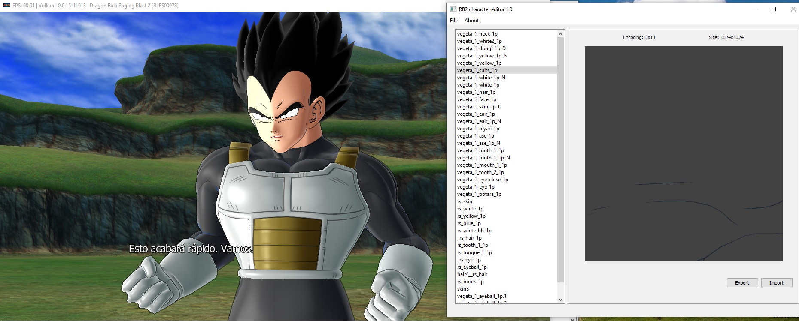
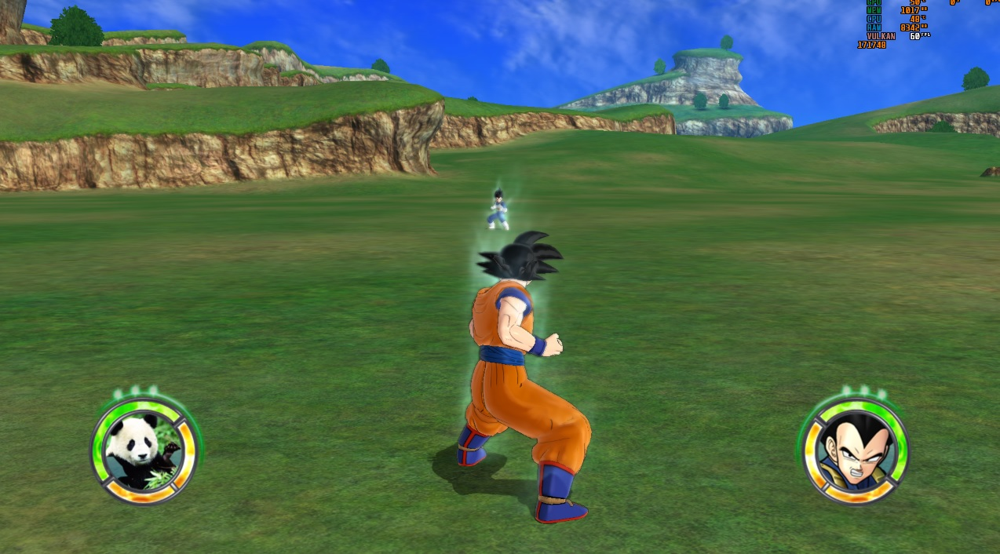

# vram explorer

This tool will help you to explore the \*.vram files from the game Dragon Ball Raging Blast, Dragon Ball Raging Blast 2 and Dragon Ball Z Ultimate Tenkaichi. 

Also, you can export and import the textures into those files.

Credits to the Raging Blast Modding community and specially to revelation from [XeNTaX](https://forum.xentax.com) forum who made the compress/uncompress tool.

You can get access to the Raging Blast Modding community in the [Discord](https://discord.gg/tBmcwkGUE6) server

## 1.5 version

Support for png images. Now you can explore, export and import textures into those files that have png textures.

<strong>WARNING</strong>: If you try to load a file that has a very large image texture, it will take some time to load it, so don't close the program even you see it's not responding.

