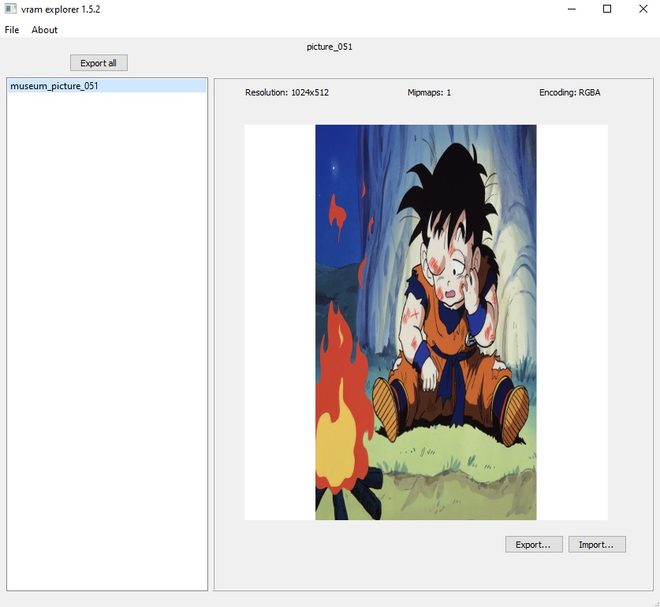
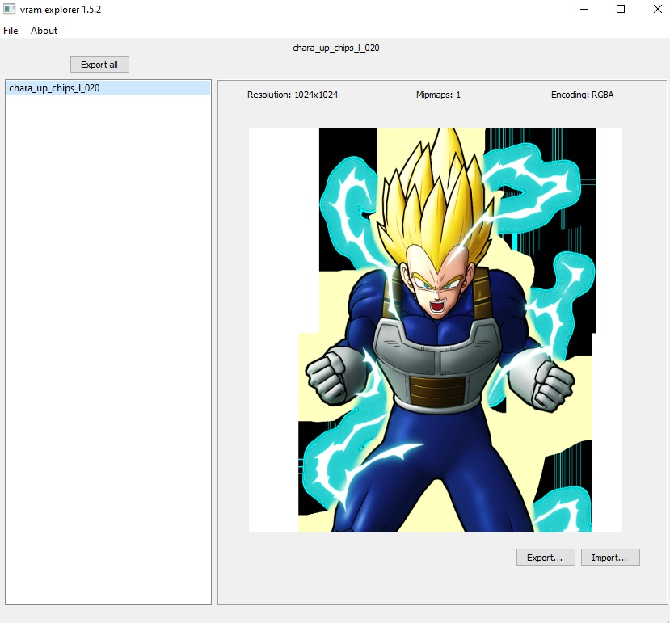
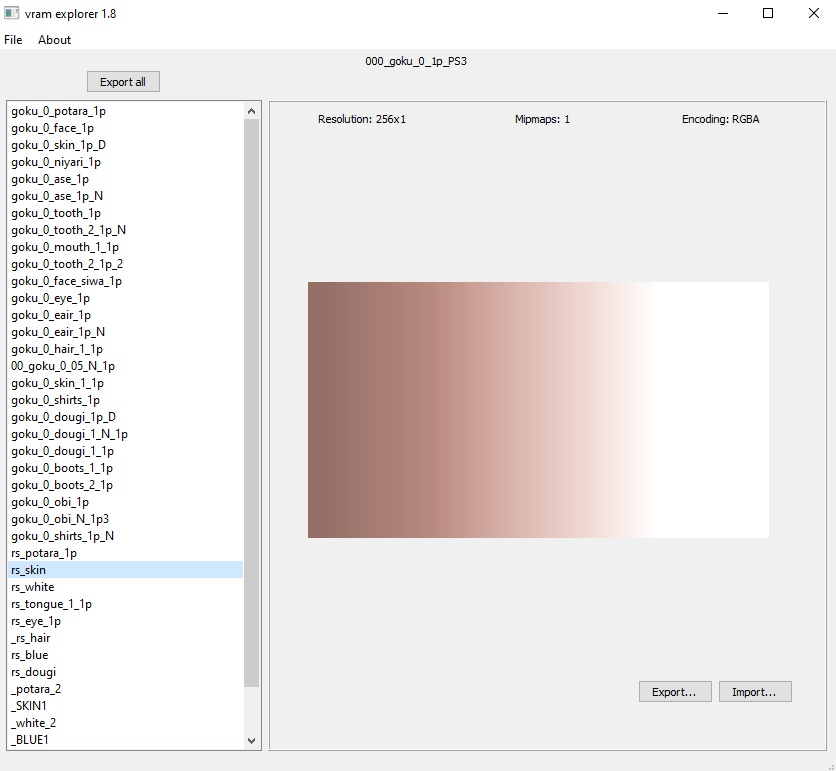

# DEPRECATED! This tool was moved to this new repository: [Raging tools](https://github.com/adsl14/Raging-tools)

# vram explorer

This tool will help you to explore the \*.vram files from the game Dragon Ball Raging Blast, Dragon Ball Raging Blast 2 and Dragon Ball Z Ultimate Tenkaichi. 

Also, you can export and import the textures into those files.

Credits to the Raging Blast Modding community and specially to revelation from [XeNTaX](https://forum.xentax.com) forum who made the compress/uncompress tool.

You can get access to the Raging Blast Modding community in the [Discord](https://discord.gg/tBmcwkGUE6) server

## 1.5 version

Support for png images. Now you can explore, export and import textures into those files that have png textures.

  
   

## 1.8 version

The shaders has a height equals to 1 and can't be displayed clearly because of that. Now in the display, the height will be greater in pos of displaying the shaders better.

